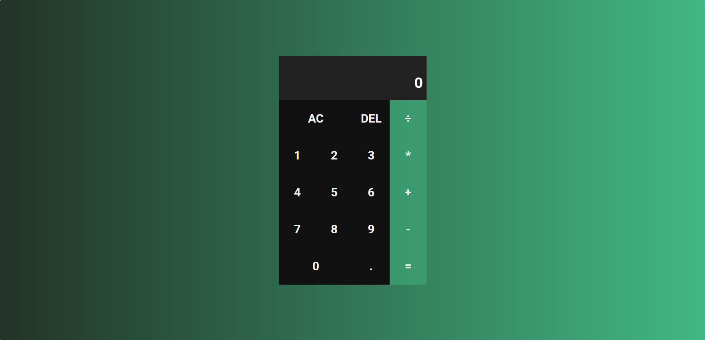

<h1 align="center"> Calculadora FSC 🧮 </h1>

<p align="center">
  <a href="#-funcionalidades">🚀 Funcionalidades</a>&nbsp;&nbsp;&nbsp;|&nbsp;&nbsp;&nbsp;
  <a href="#-demonstração">🌐 Demonstração</a>&nbsp;&nbsp;&nbsp;|&nbsp;&nbsp;&nbsp;
  <a href="#-tecnologias-utilizadas">🛠️ Tecnologias Utilizadas</a>
  <br>
  <a href="#-como-executar-localmente">📦 Como executar localmente</a>&nbsp;&nbsp;&nbsp;|&nbsp;&nbsp;&nbsp;
  <a href="#-contribuição">🤝 Contribuição</a>&nbsp;&nbsp;&nbsp;|&nbsp;&nbsp;&nbsp;
  <a href="#-licença">📄 Licença</a>
</p>

<p align="center">
  
</p>

<p align="center">
  
</p>


## Calculadora FSC

Uma aplicação simples de calculadora com operações básicas e layout responsivo.  
Acesse a versão hospedada: 👉 [Calculadora FSC](https://calebemedeiros.github.io/CalculadoraFSC)

### Descrição

Aplicação front-end que apresenta uma calculadora funcional com suporte às principais operações matemáticas: soma, subtração, multiplicação e divisão.  
Ideal como componente para sites estáticos ou como exemplo didático de manipulação de DOM e lógica em JavaScript.

---

## 🚀 Funcionalidades

- Interface intuitiva com botões numéricos e operadores.
- Suporte às operações básicas: `+`, `-`, `×`, `÷`.
- Exibição dinâmica dos cálculos.
- Layout responsivo para uso em dispositivos móveis e desktop.
- Feedback visual para interação dos botões.

---

## 🌐 Demonstração

Você pode testar diretamente no navegador:  
👉 [Calculadora FSC - GitHub Pages](https://calebemedeiros.github.io/CalculadoraFSC)

---

## 🛠️ Tecnologias Utilizadas

- **HTML5**
- **CSS3**
- **JavaScript**
- **GitHub Pages** - (para hospedagem)

---

## 📦 Como executar localmente

1. Clone o repositório:
   ```bash
   git clone https://github.com/calebemedeiros/CalculadoraFSC.git
   ```
2. Acesse a pasta do projeto:
   ```bash
   cd CalculadoraFSC
   ```
3. Abra o arquivo `index.html` no seu navegador.

---

## 🤝 Contribuição

Contribuições são bem-vindas.  
Siga este fluxo:

1. Faça um fork do repositório.
2. Crie uma branch para sua feature:
   ```bash
   git checkout -b minha-feature
   ```
3. Faça commits claros:
   ```bash
   git commit -m "Descrição da mudança"
   ```
4. Envie para sua branch:
   ```bash
   git push origin minha-feature
   ```
5. Abra um Pull Request no repositório original.

---

## 📄 Licença

    Projeto disponibilizado sob a licença **MIT**.  
    Sinta-se livre para usar, modificar e distribuir.

---

### 👨‍💻 Autor

Desenvolvido por **[Calebe Medeiros](https://github.com/calebemedeiros)** ✨